# Washing Machine Controller, Ver. 02: Pause and Fault Handling

## Project Overview

This project implements Ver. 02 of a requirement-based Washing Machine Controller using MATLAB, Simulink, Stateflow, and Requirements Toolbox.

Ver. 02 builds on the Ver. 01 core-cycle controller by adding pause/resume behavior, Stateflow history-based resume, active-cycle fault handling, detergent-fill timeout fault detection, and fault reset behavior.

The main objective of this version is to demonstrate how a Stateflow controller can evolve from nominal sequence control into a more robust controller with interruption handling, safety gating, fault response, and requirement traceability.

---

## Version Scope

Ver. 02 covers:

- Core washing-machine cycle sequence from Ver. 01
- Hierarchical `Active_Washing_Cycle` state
- Stateflow history junction for resume behavior
- Pause handling during active cycle stages
- Resume only when the door is closed
- Door lock retained during pause and fault states
- Generic fault transition from active washing cycle
- Fault response with all active actuators turned OFF
- Detergent-fill timeout fault
- Fault reset back to Idle
- Requirement authoring, linking, consistency checking, and traceability
- Simulation evidence for nominal, pause/resume, fault, and timeout scenarios

Ver. 02 does not include the `stage_status` output or mutual-exclusion diagnostic output. Those refinements are implemented in Ver. 03.

---

## Tools Used

- MATLAB R2026a
- Simulink
- Stateflow
- Requirements Toolbox

---

## Folder Structure

```text
WMC-Ver02-PauseFault/
├── images/
│   ├── WMC_Ver02_Chart.png
│   ├── WMC_Ver02_Chart_Spin_Resume_with_Door_Open.png
│   ├── WMC_Ver02_Chart_with_Links.png
│   ├── WMC_Ver02_Requirements_Consistency_Check.png
│   ├── WMC_Ver02_Requirements_Consistency_Check_Report.png
│   ├── WMC_Ver02_Requirements_Links_Part1.png
│   ├── WMC_Ver02_Requirements_Links_Part2.png
│   ├── WMC_Ver02_Requirements_Traceability_Matrix.png
│   ├── WMC_Ver02_Rinse_Entry_Before_Fault.png
│   ├── WMC_Ver02_Rinse_Entry_Before_Pause.png
│   ├── WMC_Ver02_Rinse_Fault.png
│   ├── WMC_Ver02_Rinse_Fault_Idle_Reset.png
│   ├── WMC_Ver02_Rinse_Paused.png
│   ├── WMC_Ver02_Rinse_Resumed.png
│   ├── WMC_Ver02_Spin_Entry_Before_Fault.png
│   ├── WMC_Ver02_Spin_Entry_Before_Pause.png
│   ├── WMC_Ver02_Spin_Fault.png
│   ├── WMC_Ver02_Spin_Fault_Idle_Reset.png
│   ├── WMC_Ver02_Spin_Paused.png
│   ├── WMC_Ver02_Spin_Resume_with_Door_Open.png
│   ├── WMC_Ver02_Spin_Resumed.png
│   ├── WMC_Ver02_Symbols_Pane.png
│   ├── WMC_Ver02_Top_Level_Model.png
│   ├── WMC_Ver02_Wash_Detergent_Fill_Before_Timeout.png
│   ├── WMC_Ver02_Wash_Detergent_Fill_Fault_After_Timeout.png
│   ├── WMC_Ver02_Wash_Detergent_Fill_Timeout_Fault_Reset.png
│   ├── WMC_Ver02_Wash_Entry_Before_Fault.png
│   ├── WMC_Ver02_Wash_Entry_Before_Pause.png
│   ├── WMC_Ver02_Wash_Fault.png
│   ├── WMC_Ver02_Wash_Fault_Idle_Reset.png
│   ├── WMC_Ver02_Wash_Paused.png
│   └── WMC_Ver02_Wash_Resumed.png
├── model/
│   └── WMC_Ver_02_PauseFault.slx
├── requirements/
│   ├── WMC_Ver02_PauseFault_Requirements.pdf
│   ├── WMC_Ver02_PauseFault_Requirements.xlsx
│   ├── WMC_Ver_02_PauseFault_Requirements.slreqx
│   └── WMC_Ver_02_PauseFault~mdl.slmx
├── results/
│   ├── WMC_Ver_02_PauseFault_Requirements_Report.pdf
│   ├── WMC_Ver02_PauseFault_Requirements_Consistency_Check_Report.pdf
│   ├── WMC_Ver02_PauseFault_Requirements_Traceability_Matrix.html
│   ├── WMC_Ver02_PauseFault_Requirements_Traceability_Matrix.xlsx
│   ├── WMC_Ver02_Scope_Actuator_Outputs.png
│   ├── WMC_Ver02_Scope_Detergent_Fill_Timeout_Fault_Activation_and_Reset.png
│   ├── WMC_Ver02_Scope_Detergent_Valve_Before_and_After_Timeout.png
│   ├── WMC_Ver02_Scope_Diagnostic_Outputs.png
│   ├── WMC_Ver02_Scope_Rinse_Cycle_Fault.png
│   ├── WMC_Ver02_Scope_Rinse_Cycle_Fault_Activation_and_Reset.png
│   ├── WMC_Ver02_Scope_Rinse_Paused_and_Resumed.png
│   ├── WMC_Ver02_Scope_Spin_Cycle_Fault.png
│   ├── WMC_Ver02_Scope_Spin_Cycle_Fault_Activation_and_Reset.png
│   ├── WMC_Ver02_Scope_Spin_Paused_and_Resumed.png
│   ├── WMC_Ver02_Scope_Wash_Cycle_Fault.png
│   ├── WMC_Ver02_Scope_Wash_Cycle_Fault_Activation_and_Reset.png
│   └── WMC_Ver02_Scope_Wash_Paused_and_Resumed.png
└── README.md


```
---

## Controller Interface

### Inputs

| Signal | Description |
|---|---|
| `start_button` | Starts the washing cycle when the door is closed. |
| `pause_button` | Pauses the active washing cycle. |
| `resume_button` | Resumes the paused cycle when the door is closed. |
| `reset_button` | Resets the controller from Fault to Idle when the fault signal is cleared. |
| `door_closed` | Indicates whether the washing-machine door is closed. |
| `water_level_ok` | Indicates that the required water level has been reached. |
| `detergent_level_ok` | Indicates that detergent filling is complete. |
| `fault_signal` | External fault input used to force the controller into Fault. |

---

### Outputs

| Signal | Description |
|---|---|
| `door_lock` | Locks the door during active cycle, pause, and fault states. |
| `water_valve` | Controls water filling during wash-fill and rinse-fill stages. |
| `detergent_valve` | Controls detergent filling. |
| `drain_pump` | Controls draining after wash and rinse stages. |
| `wash_motor` | Runs during Wash and Rinse stages. |
| `spin_motor` | Runs during Spin stage. |
| `cycle_complete` | Indicates successful completion of the washing cycle. |
| `fault_indicator` | Indicates that the controller is in Fault state. |

---

### Parameters

| Parameter | Value | Purpose |
|---|---:|---|
| `door_lock_delay` | `10 secs` | Delay before entering wash water fill after door locking. |
| `wash_duration` | `20*60 secs ` | Wash stage duration. |
| `drain_duration` | `4*60 secs` | Drain duration shared by wash-drain and rinse-drain stages. |
| `rinse_duration` | `15*60 secs` | Rinse stage duration. |
| `spin_duration` | `10*60 secs` | Spin stage duration. |
| `detergent_fill_timeout` | `30 secs` | Timeout used to detect detergent-fill failure. |

---

## Top-Level Simulink Model

The top-level model contains dashboard-style input controls, the Stateflow controller block, and separated actuator and diagnostic output groups.

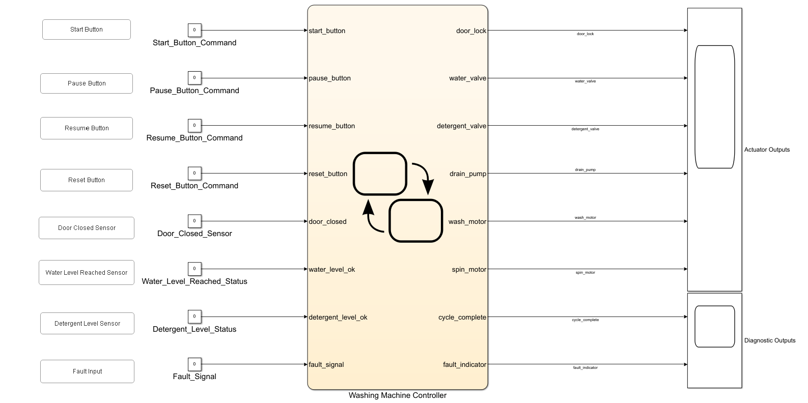

The outputs are grouped as:

| Group | Signals |
|---|---|
| Actuator Outputs | `door_lock`, `water_valve`, `detergent_valve`, `drain_pump`, `wash_motor`, `spin_motor` |
| Diagnostic Outputs | `cycle_complete`, `fault_indicator` |

This separation makes the simulation evidence easier to review, because physical actuator behavior and diagnostic status are inspected independently.

---

## Stateflow Design

The Ver. 02 Stateflow chart extends the Ver. 01 sequence by introducing a hierarchical `Active_Washing_Cycle` state and top-level `Paused` and `Fault` states.

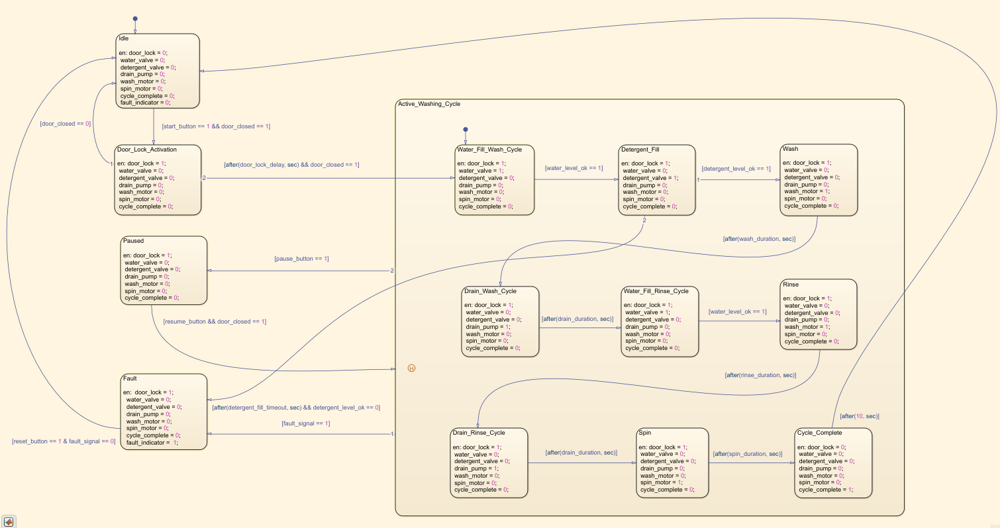

---

### Top-Level States

| State | Purpose |
|---|---|
| `Idle` | Default safe state. All actuators are OFF. |
| `Door_Lock_Activation` | Pre-cycle preparation state that locks the door before entering the active washing cycle. |
| `Active_Washing_Cycle` | Hierarchical state containing all active washing-cycle stages. |
| `Paused` | Stops active actuators while keeping the door locked. |
| `Fault` | Turns OFF all actuators, keeps the door locked, and sets `fault_indicator = 1`. |

---

### Active Washing Cycle Substates

| Substate | Purpose |
|---|---|
| `Water_Fill_Wash_Cycle` | Fills water for the wash cycle. |
| `Detergent_Fill` | Fills detergent. |
| `Wash` | Runs the wash motor. |
| `Drain_Wash_Cycle` | Drains water after wash. |
| `Water_Fill_Rinse_Cycle` | Fills water for rinse. |
| `Rinse` | Runs the wash motor for rinse agitation. |
| `Drain_Rinse_Cycle` | Drains water after rinse. |
| `Spin` | Runs the spin motor. |
| `Cycle_Complete` | Indicates successful cycle completion and unlocks the door. |

---

### Design Notes

- `Door_Lock_Activation` is intentionally kept outside `Active_Washing_Cycle`.
- Pause/resume history behavior applies only after the active washing cycle has started.
- The Stateflow history junction is used to resume the exact interrupted active-cycle stage.
- Fault transition priority is higher than pause transition priority.
- `Paused` keeps `door_lock = 1` while turning all active actuators OFF.
- `Fault` keeps `door_lock = 1`, turns all actuators OFF, and sets `fault_indicator = 1`.
- Fault reset is allowed only when `reset_button == 1` and `fault_signal == 0`.

---

## Symbols Pane

The symbols pane shows the controller inputs, outputs, and timing parameters used in Ver. 02.

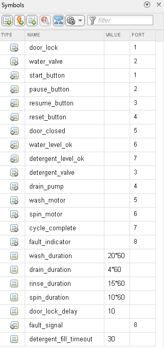

---

## Requirements

The Ver. 02 requirement set contains the Ver. 01 nominal-cycle requirements and the new pause/fault requirements.

| Requirement ID | Requirement Name | Summary |
|---|---|---|
| WMC-REQ-001 | System Initialization | Controller shall enter Idle with all actuators OFF, `cycle_complete = 0`, and `fault_indicator = 0`. |
| WMC-REQ-002 | Start Condition | Controller shall start when `start_button = 1` and `door_closed = 1`. |
| WMC-REQ-003 | Door Safety Before Start | Controller shall remain in Idle if start is pressed while the door is open. |
| WMC-REQ-004 | Door Lock Activation | Controller shall activate `door_lock` and wait for `door_lock_delay` before entering wash fill. |
| WMC-REQ-005 | Wash-Cycle Water Fill | Controller shall turn ON `water_valve` during wash fill until `water_level_ok = 1`. |
| WMC-REQ-006 | Detergent Fill Stage | Controller shall turn ON `detergent_valve` until `detergent_level_ok = 1`. |
| WMC-REQ-007 | Wash Stage | Controller shall run `wash_motor` for the configured wash duration. |
| WMC-REQ-008 | Wash-Cycle Drain | Controller shall run `drain_pump` for the configured drain duration. |
| WMC-REQ-009 | Rinse-Cycle Water Fill | Controller shall turn ON `water_valve` during rinse fill until `water_level_ok = 1`. |
| WMC-REQ-010 | Rinse Stage | Controller shall run `wash_motor` for the configured rinse duration. |
| WMC-REQ-011 | Rinse-Cycle Drain | Controller shall run `drain_pump` for the configured drain duration. |
| WMC-REQ-012 | Spin Stage | Controller shall run `spin_motor` for the configured spin duration. |
| WMC-REQ-013 | Cycle Completion | Controller shall turn OFF all actuators, unlock the door, and set `cycle_complete = 1`. |
| WMC-REQ-014 | Pause Command | Controller shall enter Paused when `pause_button = 1` during active cycle and turn OFF active actuators. |
| WMC-REQ-015 | Resume Command with History | Controller shall resume from the previously interrupted active-cycle stage using Stateflow history behavior. |
| WMC-REQ-016 | Door Safety During Pause | Controller shall not resume from Paused unless `door_closed = 1`. |
| WMC-REQ-017 | Detergent Fill Timeout Fault | Controller shall enter Fault if detergent fill does not complete within `detergent_fill_timeout`. |
| WMC-REQ-018 | Generic Fault Detection | Controller shall enter Fault when `fault_signal = 1` during active cycle. |
| WMC-REQ-019 | Fault Response | Controller shall turn OFF all actuators, keep the door locked, and set `fault_indicator = 1`. |
| WMC-REQ-020 | Fault Reset | Controller shall return to Idle only when `reset_button = 1` and `fault_signal = 0`. |

---

## Requirements Authoring and Linking

The requirements were authored externally and linked to Stateflow implementation elements using Requirements Toolbox.

Requirement source files:

```text
requirements/WMC_Ver02_PauseFault_Requirements.xlsx
requirements/WMC_Ver02_PauseFault_Requirements.pdf
```
Generated requirements report:

```text
results/WMC_Ver_02_PauseFault_Requirements_Report.pdf
```

The screenshots below show the requirement set and linked implementation elements.

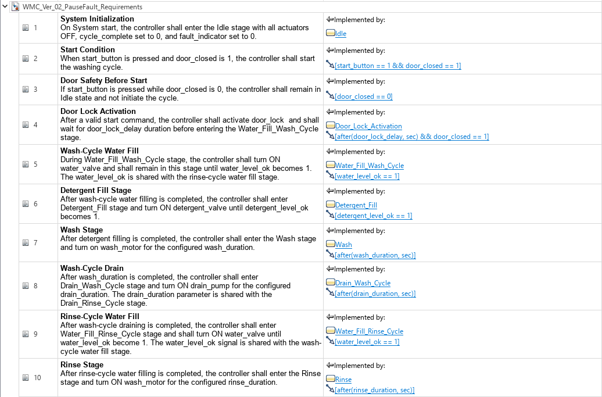

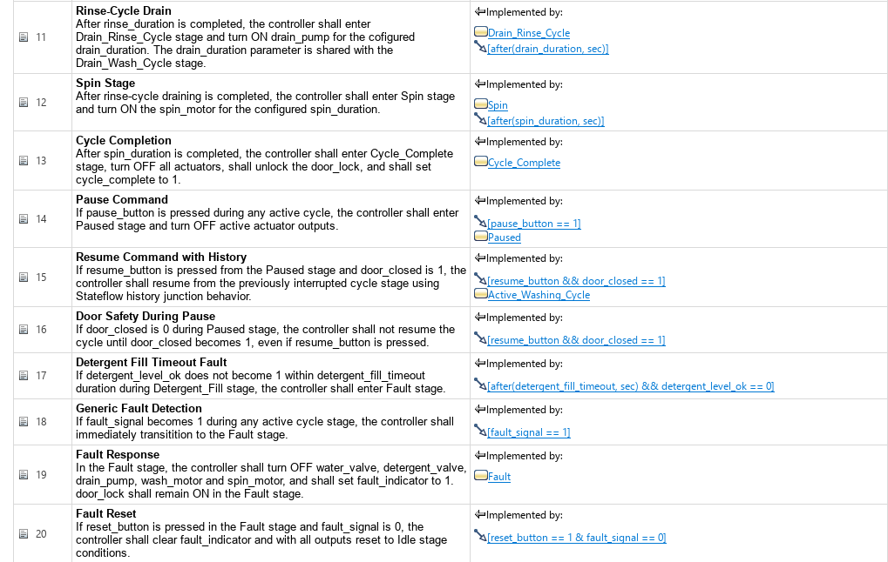

The chart below shows requirement-link indicators on the relevant Stateflow states and transitions.

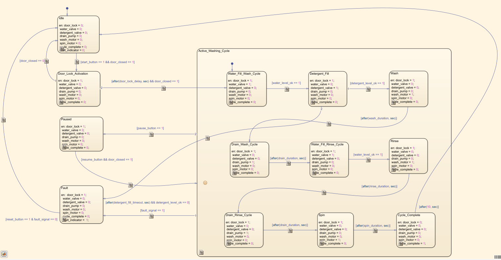

---

## Requirements Consistency Check

The Requirements Toolbox consistency check was executed after linking requirements to the Stateflow chart.

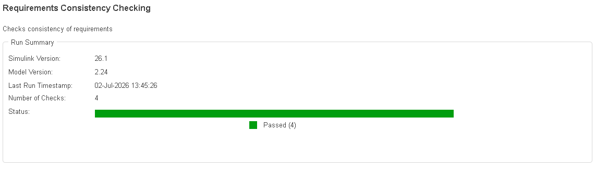

The detailed consistency check report shows that all checks passed.

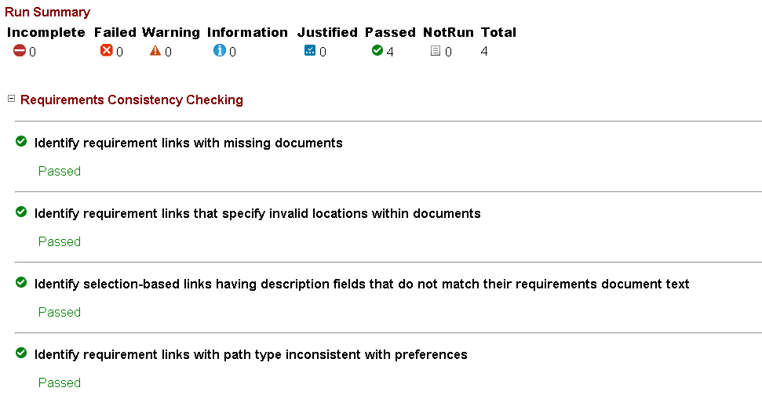

Generated report file:

```text
results/WMC_Ver02_PauseFault_Requirements_Consistency_Check_Report.pdf
```

---

### Consistency Check Result

| Check Category | Result |
|---|---|
| Missing requirement documents | ✅ Pass |
| Invalid link locations | ✅ Pass |
| Selection-based link description consistency | ✅ Pass |
| Path type consistency | ✅ Pass |

Overall result: **4 checks passed, 0 failed, 0 warnings.**

---

## Traceability Matrix

A traceability matrix was generated to confirm that the Ver. 02 requirements are mapped to Stateflow implementation elements.

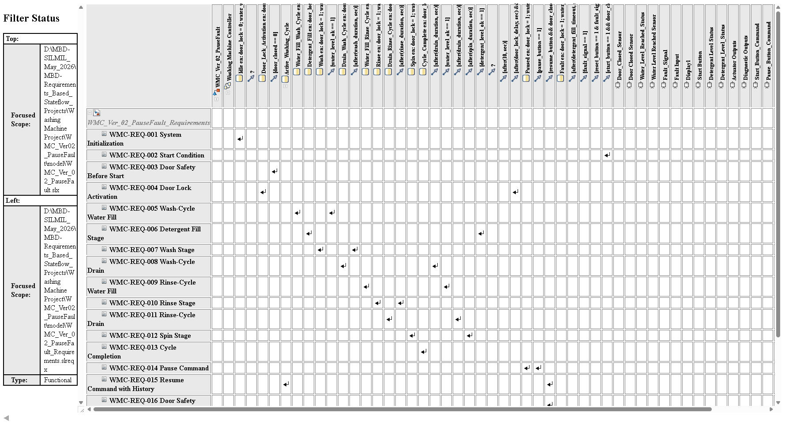

Generated traceability files:

```text
results/WMC_Ver02_PauseFault_Requirements_Traceability_Matrix.html
results/WMC_Ver02_PauseFault_Requirements_Traceability_Matrix.xlsx
```

The matrix confirms trace links from WMC-REQ-001 through WMC-REQ-020 to the corresponding model elements and transition logic.

---

## Simulation Verification

Ver. 02 was verified using multiple simulation scenarios. Scope screenshots are stored in the `results/` folder, while Stateflow active-state screenshots are stored in the `images/` folder.

### Test 1: Core-Cycle / Ideal Path Simulation

The ideal-path simulation verifies that the Ver. 02 pause/fault extensions did not break the nominal washing-machine sequence inherited from Ver. 01.

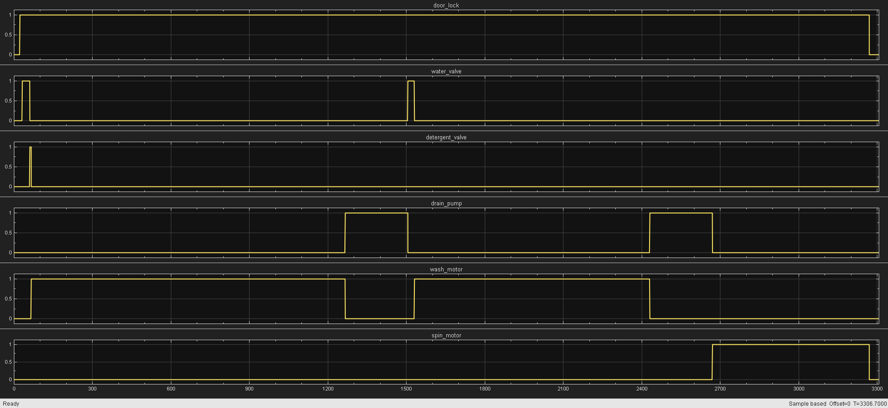

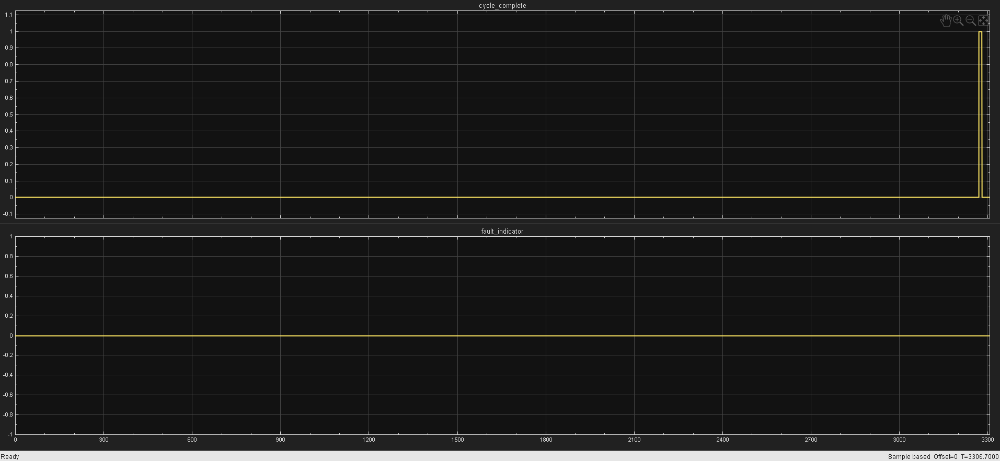

Observed behavior:

- `door_lock` remains ON during the active cycle and turns OFF after completion.
- `water_valve` turns ON for wash fill and rinse fill.
- `detergent_valve` turns ON during detergent fill.
- `wash_motor` turns ON during Wash and Rinse.
- `drain_pump` turns ON during wash drain and rinse drain.
- `spin_motor` turns ON during Spin.
- `cycle_complete` turns ON at the end of the cycle.
- `fault_indicator` remains OFF throughout the ideal path.

Result: **✅ Pass**

---

### Test 2: Pause and Resume with Stateflow History

Pause/resume behavior was verified for Wash, Rinse, and Spin. The controller enters `Paused`, turns OFF active actuators, keeps the door locked, and resumes the previously interrupted substate when `resume_button = 1` and `door_closed = 1`.

| Scenario | Before Pause | Paused | Resumed | Scope Evidence |
|---|---|---|---|---|
| Wash pause/resume | [Wash active](images/WMC_Ver02_Wash_Entry_Before_Pause.png) | [Paused](images/WMC_Ver02_Wash_Paused.png) | [Wash resumed](images/WMC_Ver02_Wash_Resumed.png) | [Wash scope](results/WMC_Ver02_Scope_Wash_Paused_and_Resumed.png) |
| Rinse pause/resume | [Rinse active](images/WMC_Ver02_Rinse_Entry_Before_Pause.png) | [Paused](images/WMC_Ver02_Rinse_Paused.png) | [Rinse resumed](images/WMC_Ver02_Rinse_Resumed.png) | [Rinse scope](results/WMC_Ver02_Scope_Rinse_Paused_and_Resumed.png) |
| Spin pause/resume | [Spin active](images/WMC_Ver02_Spin_Entry_Before_Pause.png) | [Resume blocked, door open](images/WMC_Ver02_Chart_Spin_Resume_with_Door_Open.png) | [Spin resumed](images/WMC_Ver02_Spin_Resumed.png) | [Spin scope](results/WMC_Ver02_Scope_Spin_Paused_and_Resumed.png) |

Key observations:

- Wash resumes to `Wash`, not to the default substate.
- Rinse resumes to `Rinse`, proving true history behavior even though Wash and Rinse both use `wash_motor`.
- Spin resumes to `Spin`, proving history behavior for a later-cycle state with a different actuator.
- Active actuators are OFF during Paused.
- `door_lock` remains ON during Paused.

Result: **✅ Pass**

---

### Test 3: Door Safety During Resume

Door-open resume blocking was verified during Spin pause/resume.

| Condition | Evidence | Expected Result |
|---|---|---|
| `resume_button = 1`, `door_closed = 0` | [Top-level resume with door open](images/WMC_Ver02_Spin_Resume_with_Door_Open.png) and [Paused remains active](images/WMC_Ver02_Chart_Spin_Resume_with_Door_Open.png) | Controller remains in `Paused`. |
| `resume_button = 1`, `door_closed = 1` | [Spin resumed](images/WMC_Ver02_Spin_Resumed.png) | Controller resumes through history to `Spin`. |

This verifies that the resume transition:

```text
[resume_button && door_closed == 1]
```

does not fire when the door is open.

Result: **✅ Pass**

---

### Test 4: Generic Fault Activation and Fault Reset

Fault activation and reset were verified from Wash, Rinse, and Spin.

| Scenario | Before Fault | Fault Active | Reset to Idle | Actuator Scope | Diagnostic Scope |
|---|---|---|---|---|---|
| Wash fault | [Wash active](images/WMC_Ver02_Wash_Entry_Before_Fault.png) | [Fault](images/WMC_Ver02_Wash_Fault.png) | [Idle after reset](images/WMC_Ver02_Wash_Fault_Idle_Reset.png) | [Wash fault actuator scope](results/WMC_Ver02_Scope_Wash_Cycle_Fault.png) | [Wash fault diagnostic scope](results/WMC_Ver02_Scope_Wash_Cycle_Fault_Activation_and_Reset.png) |
| Rinse fault | [Rinse active](images/WMC_Ver02_Rinse_Entry_Before_Fault.png) | [Fault](images/WMC_Ver02_Rinse_Fault.png) | [Idle after reset](images/WMC_Ver02_Rinse_Fault_Idle_Reset.png) | [Rinse fault actuator scope](results/WMC_Ver02_Scope_Rinse_Cycle_Fault.png) | [Rinse fault diagnostic scope](results/WMC_Ver02_Scope_Rinse_Cycle_Fault_Activation_and_Reset.png) |
| Spin fault | [Spin active](images/WMC_Ver02_Spin_Entry_Before_Fault.png) | [Fault](images/WMC_Ver02_Spin_Fault.png) | [Idle after reset](images/WMC_Ver02_Spin_Fault_Idle_Reset.png) | [Spin fault actuator scope](results/WMC_Ver02_Scope_Spin_Cycle_Fault.png) | [Spin fault diagnostic scope](results/WMC_Ver02_Scope_Spin_Cycle_Fault_Activation_and_Reset.png) |

Key observations:

- `fault_signal = 1` transitions the controller to `Fault`.
- The active actuator turns OFF immediately after fault activation.
- `fault_indicator` turns ON in Fault.
- `cycle_complete` remains OFF during fault.
- `door_lock` remains ON during fault.
- Reset returns the controller to `Idle` only after the fault signal is cleared.

Result: **✅ Pass**

---

### Test 5: Detergent Fill Timeout Fault

The detergent-fill timeout check verifies that the controller enters Fault if detergent filling does not complete within `detergent_fill_timeout`.

| Evidence | Purpose |
|---|---|
| [Detergent Fill before timeout](images/WMC_Ver02_Wash_Detergent_Fill_Before_Timeout.png) | Shows `Detergent_Fill` active before timeout. |
| [Fault after detergent timeout](images/WMC_Ver02_Wash_Detergent_Fill_Fault_After_Timeout.png) | Shows transition to Fault after timeout. |
| [Detergent valve before and after timeout](results/WMC_Ver02_Scope_Detergent_Valve_Before_and_After_Timeout.png) | Shows `detergent_valve` ON before timeout and OFF after fault. |
| [Timeout fault activation and reset](results/WMC_Ver02_Scope_Detergent_Fill_Timeout_Fault_Activation_and_Reset.png) | Shows `fault_indicator` ON during fault and OFF after reset. |
| [Timeout fault reset to Idle](images/WMC_Ver02_Wash_Detergent_Fill_Timeout_Fault_Reset.png) | Shows controller returned to Idle after reset. |

The timeout transition is:

```text
[after(detergent_fill_timeout, sec) && detergent_level_ok == 0]
```

Key observations:

- `Detergent_Fill` remains active while `detergent_level_ok = 0`.
- Once `detergent_fill_timeout` expires, controller enters `Fault`.
- `detergent_valve` turns OFF after timeout fault.
- `fault_indicator` turns ON in Fault.
- Reset returns the controller to Idle.

Result: **✅ Pass**

---

## Verification Summary

| Verification Item | Requirement Coverage | Status |
|---|---|---|
| Core-cycle / ideal-path simulation | WMC-REQ-001 to WMC-REQ-013 | ✅ Pass |
| Pause during Wash, Rinse, and Spin | WMC-REQ-014 | ✅ Pass |
| Resume using Stateflow history | WMC-REQ-015 | ✅ Pass |
| Resume blocked when door is open | WMC-REQ-016 | ✅ Pass |
| Detergent-fill timeout fault | WMC-REQ-017 | ✅ Pass |
| Generic fault detection | WMC-REQ-018 | ✅ Pass |
| Fault response | WMC-REQ-019 | ✅ Pass |
| Fault reset to Idle | WMC-REQ-020 | ✅ Pass |
| Requirement authoring and linking | WMC-REQ-001 to WMC-REQ-020 | ✅ Pass |
| Requirements consistency check | Requirements Toolbox checks | ✅ Pass |
| Traceability matrix generation | Requirements to Stateflow elements | ✅ Pass |

---

## Learning Outcomes

This version demonstrates:

- Hierarchical Stateflow modeling
- Use of Stateflow history junctions
- Pause and resume behavior in a state-machine controller
- Door-safety gating during resume
- Fault priority over pause behavior
- Fault-state output handling
- Timeout-based fault detection using `after()`
- Reset logic from Fault to Idle
- Requirement authoring and linking
- Requirements consistency checking
- Traceability matrix generation
- Professional verification evidence collection

---

## Limitations of Ver. 02

Ver. 02 intentionally focuses on pause/resume and fault behavior. It does not include:

- `stage_status` diagnostic output
- Text-based stage display at the top level
- Mutual-exclusion violation diagnostic signal
- Expanded diagnostic scope for stage-status verification

These refinements are implemented in Ver. 03.

---

## Planned Version Progression

| Version | Focus |
|---|---|
| Ver. 01 | Core washing-machine cycle sequence with requirements and traceability |
| Ver. 02 | Pause/resume behavior, history junction, fault handling, and timeout fault |
| Ver. 03 | Stage-status output, mutual-exclusion diagnostics, and refined validation evidence |

---

## Conclusion

WMC Ver. 02 extends the nominal Ver. 01 controller into a more robust Stateflow model with pause/resume behavior, history-based continuation, door-safe resume logic, active-cycle fault handling, detergent-fill timeout detection, and reset behavior.

The version is supported by authored requirements, linked implementation elements, consistency-check evidence, a generated traceability matrix, and simulation evidence across ideal-path, pause/resume, fault, and timeout scenarios.

This version forms the safety and interruption-handling foundation for the diagnostic refinements introduced in Ver. 03.

---

## License

MIT License

---
