# Washing Machine Controller, Ver. 03: Final Model with Diagnostics and Stage Status

## Project Overview

This project implements Ver. 03 of a requirement-based Washing Machine Controller using MATLAB, Simulink, Stateflow, and Requirements Toolbox.

Ver. 03 builds on the Ver. 01 core-cycle controller and the Ver. 02 pause/fault controller by adding diagnostic visibility, top-level stage-status display, actuator mutual-exclusion monitoring, and expanded requirements traceability.

The main objective of this version is to demonstrate how an already verified Stateflow controller can be refined into a more observable and verification-friendly model. Ver. 03 does not replace the earlier behavior. Instead, it re-verifies the inherited behavior from Ver. 01 and Ver. 02 while adding diagnostic outputs that make simulation evidence easier to review from the top-level Simulink model.

---

## Version Scope

Ver. 03 covers:

- Core washing-machine cycle sequence inherited from Ver. 01
- Pause/resume behavior inherited from Ver. 02
- Stateflow history-based resume inherited from Ver. 02
- Detergent-fill timeout fault inherited from Ver. 02
- Generic fault activation and reset inherited from Ver. 02
- Door-lock safe-state behavior
- Idle output reset behavior
- `stage_status` output for active-stage indication
- `Stage_Status_Display` subsystem for top-level stage visibility
- `mutual_exclusion_violation` diagnostic output
- Top-level actuator mutual-exclusion check for `wash_motor` and `spin_motor`
- Requirement authoring, linking, consistency checking, and traceability
- Simulation evidence for ideal path, pause/resume, timeout fault, generic fault, diagnostics, and regression consistency

Ver. 03 improves model observability. In Ver. 01 and Ver. 02, active-stage confirmation depended heavily on opening the Stateflow chart and checking active-state highlighting. In Ver. 03, the active stage can be verified directly from the top-level model using the `Stage_Status_Display` subsystem.

---

## Tools Used

- MATLAB R2026a
- Simulink
- Stateflow
- Requirements Toolbox

---

## Folder Structure

```text
WMC-Ver03-Final-Model/
|-- images/
|   |-- WMC_Ver03_Top_Level_Model.png
|   |-- WMC_Ver03_Chart.png
|   |-- WMC_Ver03_Stage_Status_Display_Subsystem.png
|   |-- WMC_Ver03_Motor_Mutual_Exclusion_Violation_Check.png
|   |-- WMC_Ver03_Symbols_Pane.png
|   |-- WMC_Ver03_Requirements_with_Links_Part1.png
|   |-- WMC_Ver03_Requirements_with_Links_Part2.png
|   |-- WMC_Ver03_Chart_with_Links.png
|   |-- WMC_Ver03_Top_Level_Model_with_Links.png
|   |-- WMC_Ver03_Requirements_Consistency_Check.png
|   |-- WMC_Ver03_Requirements_Consistency_Check_Report.png
|   |-- WMC_Ver03_Requirements_Traceability_Matrix.png
|   `-- simulation_state_evidence_images
|-- model/
|   `-- WMC_Ver_03_Final_Model.slx
|-- requirements/
|   |-- WMC_Ver03_Final_Model_Requirements.pdf
|   |-- WMC_Ver03_Final_Model_Requirements.xlsx
|   |-- WMC_Ver03_Final_Model_Requirements.slreqx
|   `-- WMC_Ver_03_Final_Model~mdl.slmx
|-- results/
|   |-- WMC_Ver03_Final_Model_Requirements_Consistency_Report.html
|   |-- WMC_Ver03_Final_Model_Requirements_Consistency_Report.pdf
|   |-- WMC_Ver03_Final_Model_Requirements_Report.pdf
|   |-- WMC_Ver03_Final_Model_Requirements_Traceability_Matrix.html
|   |-- WMC_Ver03_Final_Model_Requirements_Traceability_Matrix.xlsx
|   `-- simulation_scope_results
`-- README.md
```

> Note: Scope output screenshots are stored in the `results/` folder. All other screenshots, including model, chart, requirement-link, consistency-check, traceability, and top-level stage-status evidence screenshots, are stored in the `images/` folder.

---

## Controller Interface

### Inputs

| Signal | Description |
|---|---|
| `start_button` | Starts the washing cycle when the door is closed. |
| `pause_button` | Pauses the active washing cycle. |
| `resume_button` | Resumes the paused cycle when the door is closed. |
| `reset_button` | Resets the controller from Fault to Idle when the fault signal is cleared. |
| `door_closed` | Indicates whether the washing-machine door is closed. |
| `water_level_ok` | Indicates that the required water level has been reached. |
| `detergent_level_ok` | Indicates that detergent filling is complete. |
| `fault_signal` | External fault input used to force the controller into Fault. |

---

### Outputs

| Signal | Description |
|---|---|
| `door_lock` | Locks the door during active cycle, pause, and fault states. |
| `water_valve` | Controls water filling during wash-fill and rinse-fill stages. |
| `detergent_valve` | Controls detergent filling. |
| `drain_pump` | Controls draining after wash and rinse stages. |
| `wash_motor` | Runs during Wash and Rinse stages. |
| `spin_motor` | Runs during Spin stage. |
| `cycle_complete` | Indicates successful completion of the washing cycle. |
| `fault_indicator` | Indicates that the controller is in Fault state. |
| `stage_status` | Numeric output that indicates the currently active controller stage. |
| `mutual_exclusion_violation` | Diagnostic output that becomes 1 if `wash_motor` and `spin_motor` are ON at the same time. |

---

### Parameters

| Parameter | Value | Purpose |
|---|---:|---|
| `door_lock_delay` | `10 secs` | Delay before entering wash water fill after door locking. |
| `wash_duration` | `20*60 secs` | Wash stage duration. |
| `drain_duration` | `4*60 secs` | Drain duration shared by wash-drain and rinse-drain stages. |
| `rinse_duration` | `15*60 secs` | Rinse stage duration. |
| `spin_duration` | `10*60 secs` | Spin stage duration. |
| `detergent_fill_timeout` | `30 secs` | Timeout used to detect detergent-fill failure. |

---

## Top-Level Simulink Model

The top-level model contains dashboard-style input controls, the Stateflow controller block, actuator output grouping, diagnostic output grouping, a motor mutual-exclusion diagnostic check, and the `Stage_Status_Display` subsystem.

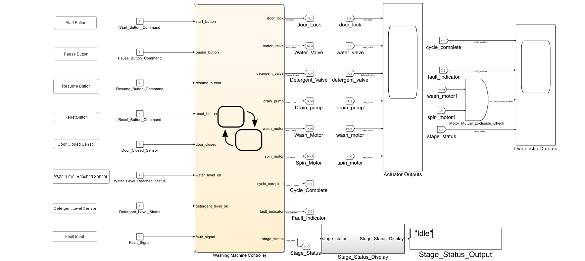

The outputs are grouped as:

| Group | Signals |
|---|---|
| Actuator Outputs | `door_lock`, `water_valve`, `detergent_valve`, `drain_pump`, `wash_motor`, `spin_motor` |
| Diagnostic Outputs | `cycle_complete`, `fault_indicator`, `mutual_exclusion_violation`, `stage_status` |

This separation makes the simulation evidence easier to review. Physical actuator behavior can be checked independently from diagnostic and status behavior.

---

## Stateflow Design

The Ver. 03 Stateflow chart retains the Ver. 02 controller logic. It includes the hierarchical `Active_Washing_Cycle` state, top-level `Paused` and `Fault` states, history-based resume behavior, timeout-based detergent fault detection, generic fault handling, and reset behavior.

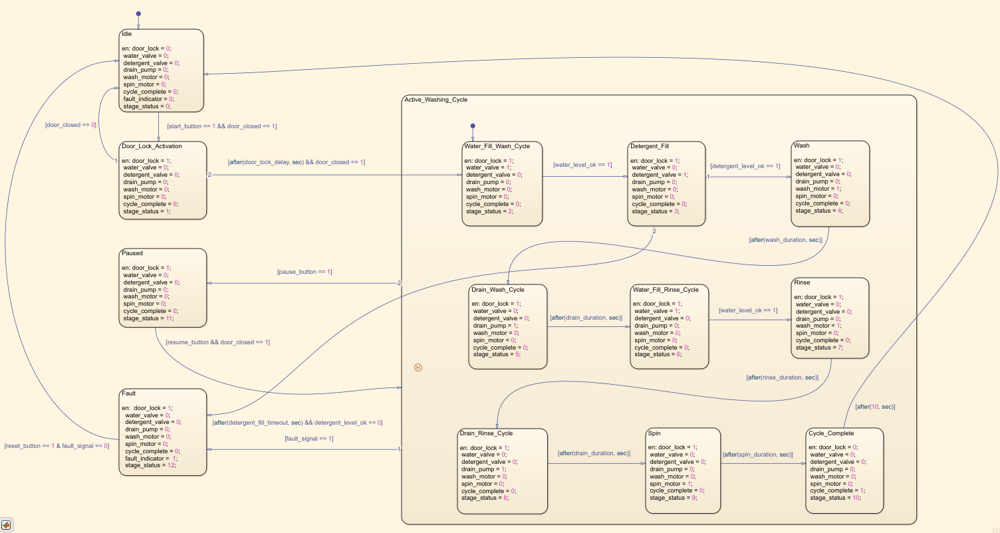

Although this chart screenshot uses the Ver. 03 prefix, the core Stateflow control logic was already implemented in Ver. 02 and retained in Ver. 03. Ver. 03 adds diagnostic visibility around the existing controller behavior.

---

### Top-Level States

| State | Purpose |
|---|---|
| `Idle` | Default safe state. All actuators are OFF. |
| `Door_Lock_Activation` | Pre-cycle preparation state that locks the door before entering the active washing cycle. |
| `Active_Washing_Cycle` | Hierarchical state containing all active washing-cycle stages. |
| `Paused` | Stops active actuators while keeping the door locked. |
| `Fault` | Turns OFF active actuators, keeps the door locked, and sets `fault_indicator = 1`. |

---

### Active Washing Cycle Substates

| Substate | Purpose |
|---|---|
| `Water_Fill_Wash_Cycle` | Fills water for the wash cycle. |
| `Detergent_Fill` | Fills detergent. |
| `Wash` | Runs the wash motor. |
| `Drain_Wash_Cycle` | Drains water after wash. |
| `Water_Fill_Rinse_Cycle` | Fills water for rinse. |
| `Rinse` | Runs the wash motor for rinse agitation. |
| `Drain_Rinse_Cycle` | Drains water after rinse. |
| `Spin` | Runs the spin motor. |
| `Cycle_Complete` | Indicates successful cycle completion and unlocks the door. |

---

### Design Notes

- `Door_Lock_Activation` is intentionally kept outside `Active_Washing_Cycle`.
- Pause/resume history behavior applies only after the active washing cycle has started.
- The Stateflow history junction resumes the exact interrupted active-cycle stage.
- Fault transition priority is higher than pause transition priority.
- `Paused` keeps `door_lock = 1` while turning active actuators OFF.
- `Fault` keeps `door_lock = 1`, turns active actuators OFF, and sets `fault_indicator = 1`.
- Fault reset is allowed only when `reset_button == 1` and `fault_signal == 0`.
- `stage_status` is assigned inside each Stateflow state to identify the active operating stage.

---

## Stage Status Display

Ver. 03 adds a `stage_status` output and a top-level `Stage_Status_Display` subsystem.

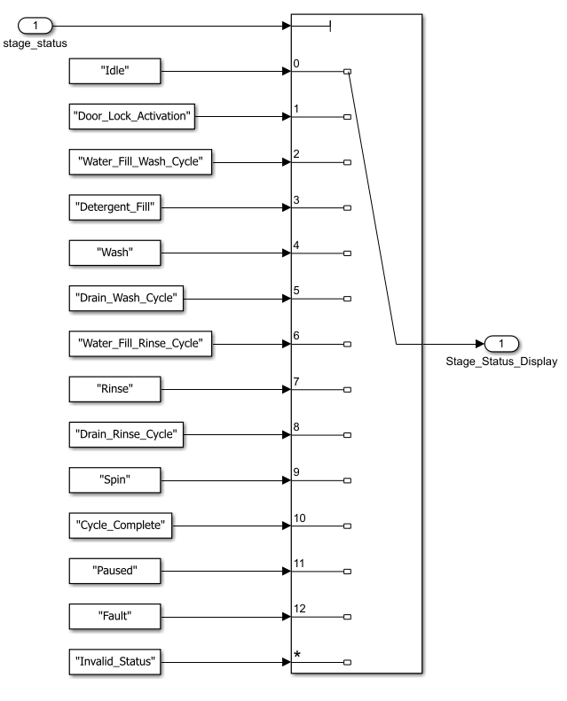

The display subsystem maps numeric `stage_status` values to readable stage names:

| `stage_status` Value | Displayed Stage |
|---:|---|
| 0 | `Idle` |
| 1 | `Door_Lock_Activation` |
| 2 | `Water_Fill_Wash_Cycle` |
| 3 | `Detergent_Fill` |
| 4 | `Wash` |
| 5 | `Drain_Wash_Cycle` |
| 6 | `Water_Fill_Rinse_Cycle` |
| 7 | `Rinse` |
| 8 | `Drain_Rinse_Cycle` |
| 9 | `Spin` |
| 10 | `Cycle_Complete` |
| 11 | `Paused` |
| 12 | `Fault` |
| Other | `Invalid_Status` |

This allows active-stage verification directly from the top-level Simulink model without opening the Stateflow chart.

---

## Mutual-Exclusion Diagnostic

Ver. 03 adds a top-level diagnostic check for actuator mutual exclusion.

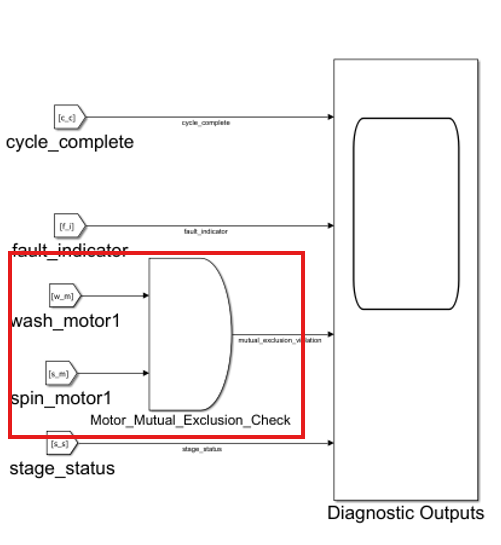

The `wash_motor` and `spin_motor` outputs are connected to an AND gate. The output of the AND gate is named `mutual_exclusion_violation`.

If both `wash_motor` and `spin_motor` are ON at the same time, `mutual_exclusion_violation` becomes 1. During all Ver. 03 simulation checks, this signal remains 0, confirming that the wash and spin motors are never active simultaneously.

This diagnostic check is implemented outside the Stateflow chart. The Stateflow chart controls behavior, while the top-level diagnostic logic monitors a safety property.

---

## Symbols Pane

The symbols pane shows the controller inputs, outputs, and timing parameters used in Ver. 03.

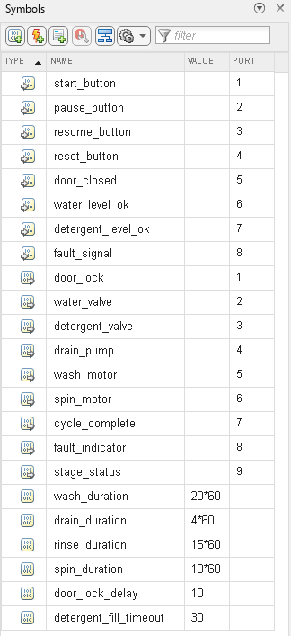

---

## Requirements

The Ver. 03 requirement set contains the inherited Ver. 01 and Ver. 02 requirements, along with additional diagnostic and observability requirements introduced in Ver. 03.

| Requirement ID | Requirement Name | Summary | Version |
|---|---|---|---|
| WMC-REQ-001 | System Initialization | Controller shall enter Idle with all actuators OFF, `cycle_complete = 0`, and `fault_indicator = 0`. | Ver. 01 |
| WMC-REQ-002 | Start Condition | Controller shall start when `start_button = 1` and `door_closed = 1`. | Ver. 01 |
| WMC-REQ-003 | Door Safety Before Start | Controller shall remain in Idle if start is pressed while the door is open. | Ver. 01 |
| WMC-REQ-004 | Door Lock Activation | Controller shall activate `door_lock` and wait for `door_lock_delay` before entering wash fill. | Ver. 01 |
| WMC-REQ-005 | Wash-Cycle Water Fill | Controller shall turn ON `water_valve` during wash fill until `water_level_ok = 1`. | Ver. 01 |
| WMC-REQ-006 | Detergent Fill Stage | Controller shall turn ON `detergent_valve` until `detergent_level_ok = 1`. | Ver. 01 |
| WMC-REQ-007 | Wash Stage | Controller shall run `wash_motor` for the configured wash duration. | Ver. 01 |
| WMC-REQ-008 | Wash-Cycle Drain | Controller shall run `drain_pump` for the configured drain duration. | Ver. 01 |
| WMC-REQ-009 | Rinse-Cycle Water Fill | Controller shall turn ON `water_valve` during rinse fill until `water_level_ok = 1`. | Ver. 01 |
| WMC-REQ-010 | Rinse Stage | Controller shall run `wash_motor` for the configured rinse duration. | Ver. 01 |
| WMC-REQ-011 | Rinse-Cycle Drain | Controller shall run `drain_pump` for the configured drain duration. | Ver. 01 |
| WMC-REQ-012 | Spin Stage | Controller shall run `spin_motor` for the configured spin duration. | Ver. 01 |
| WMC-REQ-013 | Cycle Completion | Controller shall turn OFF all actuators, unlock the door, and set `cycle_complete = 1`. | Ver. 01 |
| WMC-REQ-014 | Pause Command | Controller shall enter Paused when `pause_button = 1` during active cycle and turn OFF active actuators. | Ver. 02 |
| WMC-REQ-015 | Resume Command with History | Controller shall resume from the previously interrupted active-cycle stage using Stateflow history behavior. | Ver. 02 |
| WMC-REQ-016 | Door Safety During Pause | Controller shall not resume from Paused unless `door_closed = 1`. | Ver. 02 |
| WMC-REQ-017 | Detergent Fill Timeout Fault | Controller shall enter Fault if detergent fill does not complete within `detergent_fill_timeout`. | Ver. 02 |
| WMC-REQ-018 | Generic Fault Detection | Controller shall enter Fault when `fault_signal = 1` during active cycle. | Ver. 02 |
| WMC-REQ-019 | Fault Response | Controller shall turn OFF active actuators, keep the door locked, and set `fault_indicator = 1`. | Ver. 02 |
| WMC-REQ-020 | Fault Reset | Controller shall return to Idle only when `reset_button = 1` and `fault_signal = 0`. | Ver. 02 |
| WMC-REQ-021 | Door Unlock at Safe States | Controller shall deactivate `door_lock` only in Idle, Cycle Complete, or after a valid fault reset. | Ver. 03 |
| WMC-REQ-022 | Idle Output Reset | Controller shall reset all actuator and diagnostic outputs to safe values in Idle. | Ver. 03 |
| WMC-REQ-023 | Actuator Mutual Exclusion | Controller shall ensure that `wash_motor` and `spin_motor` are never simultaneously ON. | Ver. 03 |
| WMC-REQ-024 | Stage Status Output | Controller shall provide `stage_status` to indicate the currently active operating stage. | Ver. 03 |

---

## Verification Note for WMC-REQ-021 and WMC-REQ-022

`WMC-REQ-021` and `WMC-REQ-022` are satisfied by the Stateflow output actions already implemented in Ver. 02 and retained unchanged in Ver. 03.

For `WMC-REQ-021`, the chart deactivates `door_lock` only in safe states such as `Idle` and `Cycle_Complete`, and after a valid fault reset back to `Idle`. During `Acive_Washing_Cycle` hierarchical states, `Paused`, and `Fault`, `door_lock` remains ON.

For `WMC-REQ-022`, the `Idle` state explicitly resets all actuator outputs, `cycle_complete`, `fault_indicator`, and `stage_status` to their default safe values.

Since these behaviors are part of the existing state output definitions and are repeatedly observed in the core-cycle, pause/resume, detergent timeout, and fault reset simulations, no separate dedicated test case was required for these two requirements.

---

## Requirements Authoring and Linking

The Ver. 03 requirements were authored from the spreadsheet source file into Requirements Editor. The requirement set includes the inherited Ver. 01 and Ver. 02 requirements, along with the Ver. 03 diagnostic and observability requirements.

Requirement source files:

```text
requirements/WMC_Ver03_Final_Model_Requirements.xlsx
requirements/WMC_Ver03_Final_Model_Requirements.pdf
```

Generated requirements report:

```text
results/WMC_Ver03_Final_Model_Requirements.pdf
```

The screenshots below show the authored requirements and linked implementation elements.

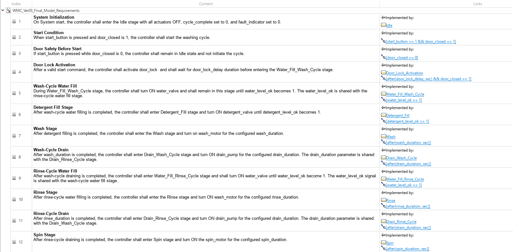

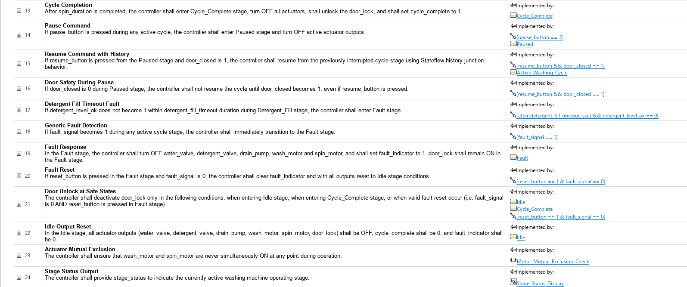

The chart below shows requirement-link indicators on the linked Stateflow states and transitions.

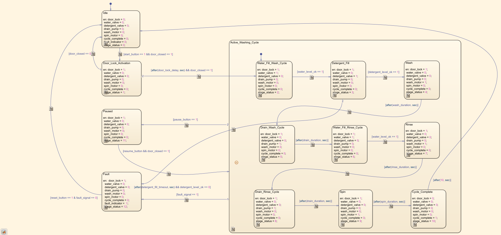

The top-level model below shows requirement-link indicators on the `Motor_Mutual_Exclusion_Check` diagnostic logic, and the `Stage_Status_Display` subsystem.

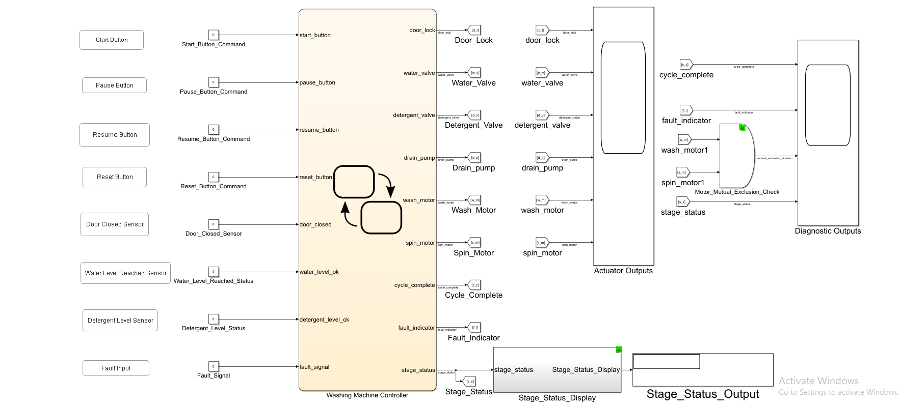

The linked implementation elements include Stateflow states, transition conditions, the `Motor_Mutual_Exclusion_Check` diagnostic logic, and the `Stage_Status_Display` subsystem.

---

## Requirements Consistency Check

The Requirements Toolbox consistency check was executed after authoring and linking the Ver. 03 requirement set to the Simulink and Stateflow implementation elements.

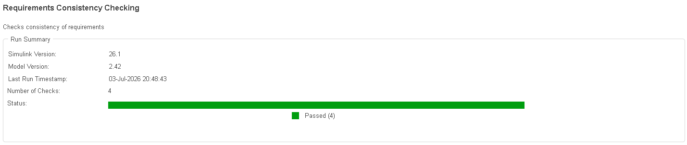

The generated Model Advisor report confirms that all requirement consistency checks passed.

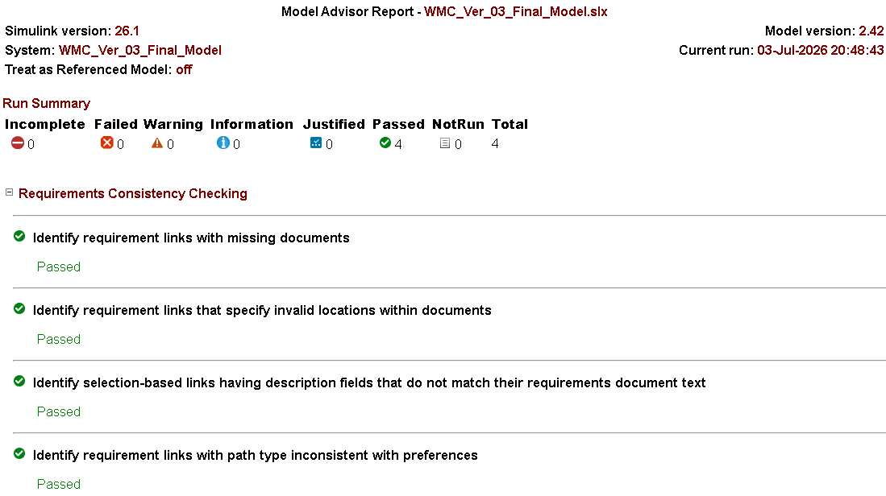

Generated report files:

```text
results/WMC_Ver03_Final_Model_Requirements_Consistency_Report.html
results/WMC_Ver03_Final_Model_Requirements_Consistency_Report.pdf
```

### Consistency Check Result

| Check Category | Result |
|---|---|
| Missing requirement documents | Pass |
| Invalid link locations | Pass |
| Selection-based link description consistency | Pass |
| Path type consistency | Pass |

Overall result: **4 checks passed, 0 failed, 0 warnings.**

---

## Traceability Matrix

A traceability matrix was generated after linking the Ver. 03 requirements to the implemented model elements.

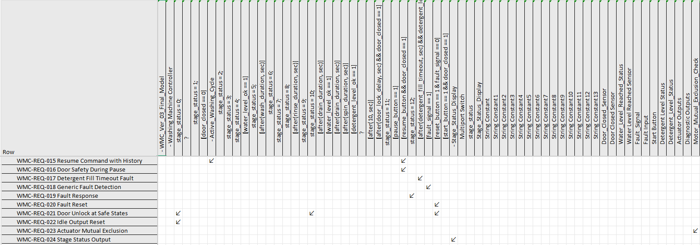

Generated traceability files:

```text
results/WMC_Ver03_Final_Model_Requirements_Traceability_Matrix.html
results/WMC_Ver03_Final_Model_Requirements_Traceability_Matrix.xlsx
```

The traceability matrix confirms that the Ver. 03 requirement set is mapped to the corresponding Stateflow states, transition conditions, top-level diagnostic logic, and display subsystem implementation elements.

This completes the requirements workflow for Ver. 03: source requirements were authored, linked to implementation elements, checked for consistency, and exported as a traceability matrix.

---

## Simulation Verification

Ver. 03 was verified using multiple simulation scenarios. Scope screenshots are stored in the `results/` folder, while top-level model, Stateflow, requirement, and stage-status evidence screenshots are stored in the `images/` folder.

The Ver. 03 verification confirms backward behavioral consistency with Ver. 01 and Ver. 02 while also validating the new diagnostic visibility added in this version.

---

### Test 1: Core-Cycle / Ideal Path Simulation

The core-cycle / ideal-path simulation verifies that the Ver. 03 controller completes the full washing-machine sequence under normal operating conditions. This test also confirms that the newly added `stage_status` output correctly updates across each active stage of the cycle.


| Stage Evidence | Screenshot |
|---|---|
| Idle start | [Idle start](images/WMC_Ver03_Idle_Start.png) |
| Door open, Idle retained | [Door open Idle](images/WMC_Ver03_Door_Open_Idle_Status.png) |
| Door lock activation | [Door lock activation](images/WMC_Ver03_Door_Lock_Activation_Status.png) |
| Wash water fill | [Wash water fill](images/WMC_Ver03_Water_Fill_Wash_Cycle_Status.png) |
| Detergent fill | [Detergent fill](images/WMC_Ver03_Detergent_Fill_Status.png) |
| Wash | [Wash](images/WMC_Ver03_Wash_Cycle_Status.png) |
| Wash drain | [Wash drain](images/WMC_Ver03_Drain_Wash_Cycle_Status.png) |
| Rinse water fill | [Rinse water fill](images/WMC_Ver03_Water_Fill_Rinse_Cycle_Status.png) |
| Rinse | [Rinse](images/WMC_Ver03_Rinse_Cycle_Status.png) |
| Rinse drain | [Rinse drain](images/WMC_Ver03_Drain_Rinse_Cycle_Status.png) |
| Spin | [Spin](images/WMC_Ver03_Spin_Cycle_Status.png) |
| Cycle complete | [Cycle complete](images/WMC_Ver03_Cycle_Complete_Status.png) |
| Cycle complete to Idle | [Cycle complete to Idle](images/WMC_Ver03_Cycle_Complete_to_Idle_Status.png) |

Key observations:

- `door_lock` remains ON during the active cycle and turns OFF after completion.
- `water_valve` turns ON for wash fill and rinse fill.
- `detergent_valve` turns ON during detergent fill.
- `wash_motor` turns ON during Wash and Rinse.
- `drain_pump` turns ON during wash drain and rinse drain.
- `spin_motor` turns ON during Spin.
- `cycle_complete` turns ON at the end of the cycle.
- `fault_indicator` remains OFF throughout the ideal path.
- `mutual_exclusion_violation` remains OFF throughout the ideal path.
- `stage_status` updates across the expected sequence.
- The top-level `Stage_Status_Display` shows the active stage without opening the Stateflow chart.

Result: **Pass**

---

### Test 2: Pause and Resume During Active Cycle States

Pause and resume behavior was verified for the Wash, Rinse, and Spin stages. In each case, the controller entered `Paused` when `pause_button = 1`, stopped the active actuator, retained the door lock, and resumed the previously interrupted stage only when `resume_button = 1` and `door_closed = 1`.

This test also verifies the Stateflow history-junction behavior introduced in Ver. 02. In Ver. 03, the behavior is easier to observe because the `Stage_Status_Display` subsystem shows the active stage directly at the top level.

| Scenario | Before Pause | Paused | Resume with Door Open | Resume with Door Closed | Completion | Actuator Scope | Diagnostic Scope |
|---|---|---|---|---|---|---|---|
| Wash pause/resume | [Wash active](images/WMC_Ver03_Wash_Cycle_Status_Before_Pause.png) | [Paused](images/WMC_Ver03_Wash_Cycle_Status_After_Pause.png) | [Resume blocked](images/WMC_Ver03_Wash_Cycle_Status_Resume_with_Door_Open.png) | [Wash resumed](images/WMC_Ver03_Wash_Cycle_Status_Resume_with_Door_Closed.png) | [Cycle complete](images/WMC_Ver03_Wash_Cycle_Status_Resume_Cycle_Complete.png) | [Actuator outputs](results/WMC_Ver03_Scope_Wash_Paused_and_Resumed_Actuator_Outputs.png) | [Diagnostic outputs](results/WMC_Ver03_Scope_Wash_Paused_and_Resumed_Diagnostic_Outputs.png) |
| Rinse pause/resume | [Rinse active](images/WMC_Ver03_Rinse_Cycle_Status_Before_Pause.png) | [Paused](images/WMC_Ver03_Rinse_Cycle_Status_After_Pause.png) | [Resume blocked](images/WMC_Ver03_Rinse_Cycle_Status_Resume_with_Door_Open.png) | [Rinse resumed](images/WMC_Ver03_Rinse_Cycle_Status_Resume_with_Door_Closed.png) | [Cycle complete](images/WMC_Ver03_Rinse_Cycle_Status_Resume_Cycle_Complete.png) | [Actuator outputs](results/WMC_Ver03_Scope_Rinse_Paused_and_Resumed_Actuator_Outputs.png) | [Diagnostic outputs](results/WMC_Ver03_Scope_Rinse_Paused_and_Resumed_Diagnostic_Outputs.png) |
| Spin pause/resume | [Spin active](images/WMC_Ver03_Spin_Cycle_Status_Before_Pause.png) | [Paused](images/WMC_Ver03_Spin_Cycle_Status_After_Pause.png) | [Resume blocked](images/WMC_Ver03_Spin_Cycle_Status_Resume_with_Door_Open.png) | [Spin resumed](images/WMC_Ver03_Spin_Cycle_Status_Resume_with_Door_Closed.png) | [Cycle complete](images/WMC_Ver03_Spin_Cycle_Status_Resume_Cycle_Complete.png) | [Actuator outputs](results/WMC_Ver03_Scope_Spin_Paused_and_Resumed_Actuator_Outputs.png) | [Diagnostic outputs](results/WMC_Ver03_Scope_Spin_Paused_and_Resumed_Diagnostic_Outputs.png) |

Key observations:

- Pause command correctly transitions the controller from Wash, Rinse, and Spin to `Paused`.
- During `Paused`, the active actuator is turned OFF.
- The top-level `Stage_Status_Display` shows `Paused` during pause.
- Resume is blocked when `resume_button = 1` but `door_closed = 0`.
- Resume succeeds when `resume_button = 1` and `door_closed = 1`.
- The controller resumes the previously interrupted stage, confirming Stateflow history behavior.
- `cycle_complete` is reached after resume, confirming that the cycle continues correctly after interruption.
- `fault_indicator` remains OFF throughout the pause/resume tests.
- `mutual_exclusion_violation` remains OFF throughout the pause/resume tests.

Result: **Pass**

---

### Test 3: Detergent Fill Timeout Fault and Reset Check

The detergent-fill timeout fault check verifies that the controller enters `Fault` if detergent filling does not complete within the configured timeout period.

In this test, the controller enters `Detergent_Fill` after the wash water-fill stage. Since `detergent_level_ok = 0`, the detergent fill remains incomplete. Once the timeout condition is reached, the controller transitions to `Fault`, turns OFF the detergent valve, activates `fault_indicator`, and updates the top-level `Stage_Status_Display` to `Fault`.

The reset behavior was also verified. When `reset_button = 1` and the reset condition is valid, the controller returns from `Fault` to `Idle`, and the `Stage_Status_Display` updates to `Idle`.

| Scenario | Before Fault | Fault Active | Reset to Idle | Actuator Scope | Diagnostic Scope |
|---|---|---|---|---|---|
| Detergent fill timeout fault and reset | [Detergent fill active](images/WMC_Ver03_Wash_Detergent_Fill_Status_Before_Fault.png) | [Timeout fault active](images/WMC_Ver03_Wash_Detergent_Fill_Timeout_Fault_Status.png) | [Reset to Idle](images/WMC_Ver03_Wash_Detergent_Fill_Timeout_Fault_Reset_to_Idle_Status.png) | [Actuator outputs](results/WMC_Ver03_Scope_Wash_Detergent_Fill_Timeout_Fault_Status_Actuator_Outputs.png) | [Diagnostic outputs](results/WMC_Ver03_Scope_Wash_Detergent_Fill_Timeout_Fault_Status_Diagnostic_Outputs.png) |

Key observations:

- `Detergent_Fill` is active before timeout while `detergent_level_ok = 0`.
- `detergent_valve` remains ON during detergent filling.
- After the timeout condition is reached, the controller transitions to `Fault`.
- `detergent_valve` turns OFF after fault activation.
- `fault_indicator` turns ON during Fault.
- `cycle_complete` remains OFF because the cycle did not complete normally.
- `stage_status` changes to the Fault value, and the display shows `Fault`.
- After reset, the controller returns to `Idle`.
- `stage_status` returns to the Idle value, and the display shows `Idle`.
- `mutual_exclusion_violation` remains OFF throughout the test.

Result: **Pass**

---

### Test 4: Fault Activation and Reset During Active Cycle States

Fault activation and reset behavior was verified for the Wash, Rinse, and Spin stages. In each case, the controller transitions from the active washing stage to `Fault` when `fault_signal = 1`.

During Fault, the active actuator is turned OFF, `fault_indicator` turns ON, `cycle_complete` remains OFF, and the top-level `Stage_Status_Display` shows `Fault`.

Reset behavior was also verified. The controller returns to `Idle` only after the reset condition is applied.

| Scenario | Before Fault | Fault Active | Reset to Idle | Actuator Scope | Diagnostic Scope |
|---|---|---|---|---|---|
| Wash fault and reset | [Wash active](images/WMC_Ver03_Wash_Cycle_Status_Before_Fault.png) | [Fault active](images/WMC_Ver03_Wash_Cycle_Status_After_Fault.png) | [Reset to Idle](images/WMC_Ver03_Wash_Cycle_Fault_Reset_to_Idle.png) | [Actuator outputs](results/WMC_Ver03_Scope_Wash_Fault_Activation_and_Reset_Actuator_Outputs.png) | [Diagnostic outputs](results/WMC_Ver03_Scope_Wash_Fault_Activation_and_Reset_Diagnostic_Outputs.png) |
| Rinse fault and reset | [Rinse active](images/WMC_Ver03_Rinse_Cycle_Status_Before_Fault.png) | [Fault active](images/WMC_Ver03_Rinse_Cycle_Status_After_Fault.png) | [Reset to Idle](images/WMC_Ver03_Rinse_Cycle_Fault_Reset_to_Idle.png) | [Actuator outputs](results/WMC_Ver03_Scope_Rinse_Fault_Activation_and_Reset_Actuator_Outputs.png) | [Diagnostic outputs](results/WMC_Ver03_Scope_Rinse_Fault_Activation_and_Reset_Diagnostic_Outputs.png) |
| Spin fault and reset | [Spin active](images/WMC_Ver03_Spin_Cycle_Status_Before_Fault.png) | [Fault active](images/WMC_Ver03_Spin_Cycle_Status_After_Fault.png) | [Reset blocked while fault remains ON](images/WMC_Ver03_Spin_Fault_Reset_with_Fault_Signal_ON.png), [Reset to Idle after fault cleared](images/WMC_Ver03_Spin_Fault_Reset_with_Fault_Signal_OFF.png) | [Actuator outputs](results/WMC_Ver03_Scope_Spin_Fault_Activation_and_Reset_Actuator_Outputs.png) | [Diagnostic outputs](results/WMC_Ver03_Scope_Spin_Fault_Activation_and_Reset_Diagnostic_Outputs.png) |

Key observations:

- `fault_signal = 1` correctly transitions the controller from Wash, Rinse, and Spin to `Fault`.
- The active actuator turns OFF after fault activation.
- `fault_indicator` turns ON during Fault.
- `cycle_complete` remains OFF because the cycle was interrupted by a fault.
- `stage_status` changes to the Fault value, and the top-level display shows `Fault`.
- Reset returns the controller to `Idle` after the fault condition is cleared.
- The Spin test additionally verifies that reset is blocked while `fault_signal` remains ON.
- `mutual_exclusion_violation` remains OFF throughout the fault tests.

Result: **Pass**

---

## Verification Summary

| Verification Item | Requirement Coverage | Status |
|---|---|---|
| Core-cycle / ideal-path simulation | WMC-REQ-001 to WMC-REQ-013, WMC-REQ-024 | ✅ Pass |
| Pause during Wash, Rinse, and Spin | WMC-REQ-014 | ✅ Pass |
| Resume using Stateflow history | WMC-REQ-015 | ✅ Pass |
| Resume blocked when door is open | WMC-REQ-016 | ✅ Pass|
| Detergent-fill timeout fault | WMC-REQ-017 | ✅ Pass |
| Generic fault detection | WMC-REQ-018 | ✅ Pass |
| Fault response | WMC-REQ-019 | ✅ Pass |
| Fault reset to Idle | WMC-REQ-020 | ✅ Pass |
| Door unlock only in safe states | WMC-REQ-021 | ✅ Pass |
| Idle output reset | WMC-REQ-022 | ✅ Pass |
| Actuator mutual exclusion | WMC-REQ-023 | ✅ Pass |
| Stage-status output and display | WMC-REQ-024 | ✅ Pass |
| Requirement authoring and linking | WMC-REQ-001 to WMC-REQ-024 | ✅ Pass |
| Requirements consistency check | Requirements Toolbox checks | ✅ Pass |
| Traceability matrix generation | Requirements to implementation elements | ✅ Pass |

---

## Learning Outcomes

This version demonstrates:

- Regression-style verification across model versions
- Requirement-based Stateflow development
- Top-level diagnostic visibility for state-machine behavior
- Stage-status encoding and display using `stage_status`
- Separation of control logic and diagnostic monitoring
- Actuator mutual-exclusion monitoring using top-level logic
- Hierarchical Stateflow modeling
- Stateflow history junction behavior
- Pause and resume behavior in a state-machine controller
- Door-safety gating during resume
- Fault priority over pause behavior
- Fault-state output handling
- Timeout-based fault detection using `after()`
- Reset logic from Fault to Idle
- Requirement authoring and linking
- Requirements consistency checking
- Traceability matrix generation
- Professional verification evidence collection

---

## Limitations of Ver. 03

Ver. 03 focuses on controller logic, diagnostic observability, and requirement traceability. It does not include:

- A formal Simulink Test test harness
- Automated test assessment blocks
- Test Manager-based pass/fail execution
- Code generation workflow
- Hardware deployment workflow

These are suitable next steps for a dedicated validation and test-harness workflow.

---

## Version Progression

| Version | Focus |
|---|---|
| Ver. 01 | Core washing-machine cycle sequence with requirements and traceability |
| Ver. 02 | Pause/resume behavior, history junction, fault handling, and timeout fault |
| Ver. 03 | Stage-status output, mutual-exclusion diagnostics, top-level observability, and refined verification evidence |

---

## Conclusion

WMC Ver. 03 completes the current Washing Machine Controller development sequence by retaining the core behavior from Ver. 01 and Ver. 02 while adding diagnostic visibility and improved verification support.

The controller successfully demonstrates nominal cycle execution, pause/resume behavior, history-based continuation, detergent-fill timeout fault handling, generic fault response, reset behavior, stage-status display, and actuator mutual-exclusion monitoring.

The version is supported by authored requirements, linked implementation elements, consistency-check evidence, a generated traceability matrix, and simulation evidence across ideal-path, pause/resume, timeout fault, and generic fault scenarios.

This version forms a strong foundation for the next validation step, where the manually collected simulation evidence can be evolved into a formal test-harness and test-management workflow.

---

## License

MIT License

---
